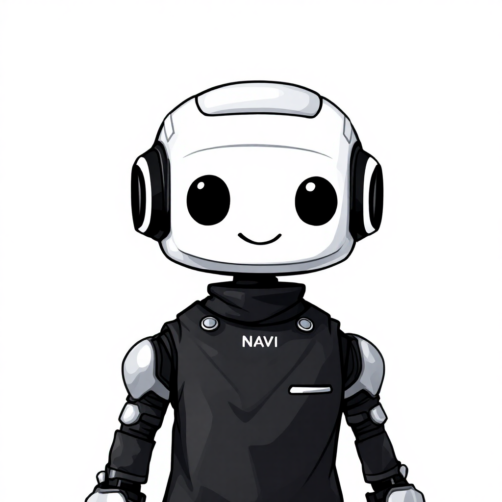
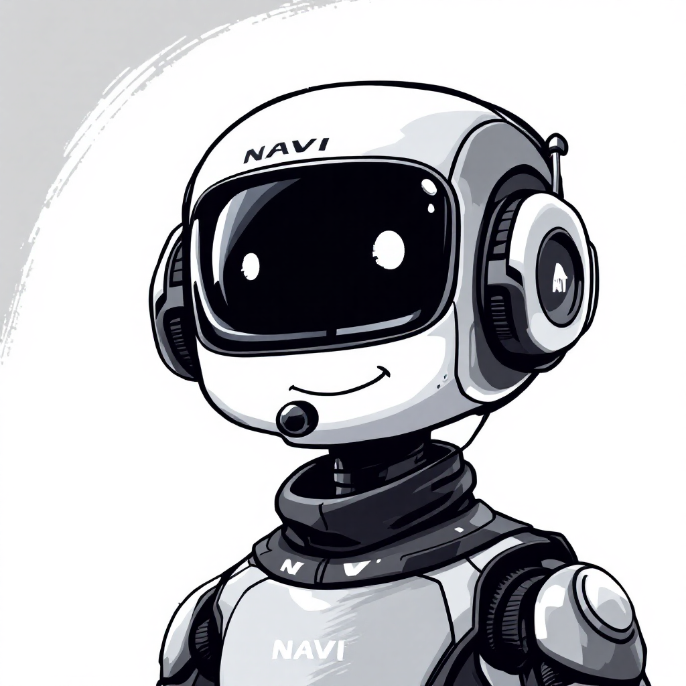
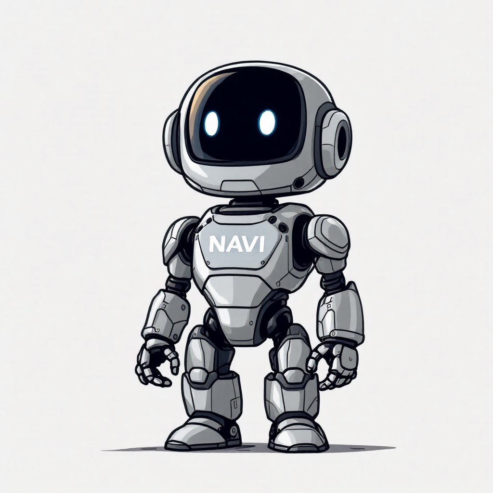
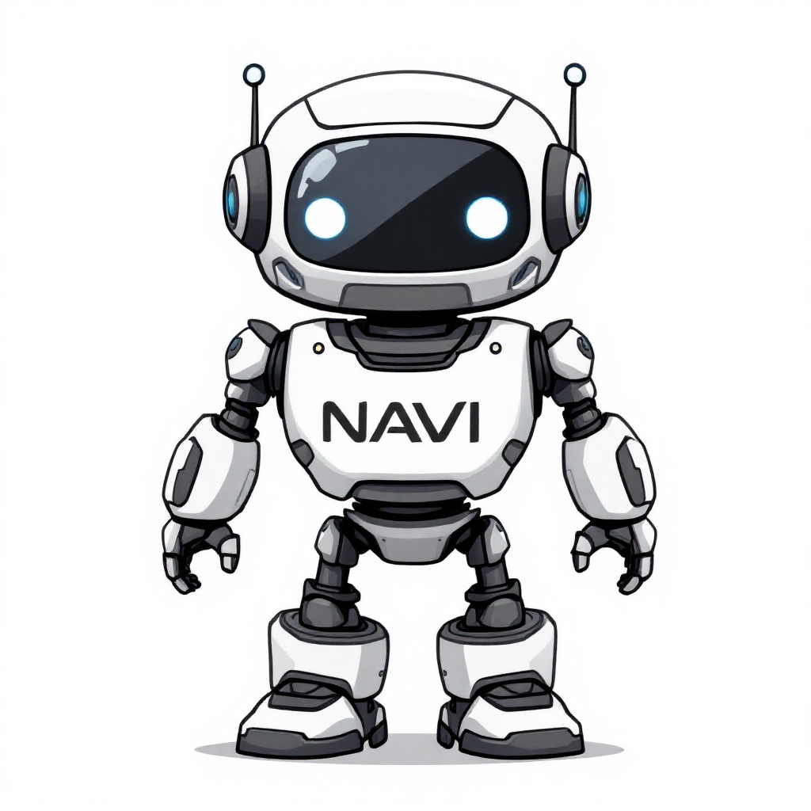

# NAVI: 사내 업무 어시스턴트

## 팀 명 : 💊💊Dopamine

| 팀장                                                                                                                                                                                                  | 팀원                                                                                                                                                                                                | 팀원                                                                                                                                                                                             | 팀원                                                                                                                                                                                                    | 팀원                                                                                                                                                                                                 |
| ----------------------------------------------------------------------------------------------------------------------------------------------------------------------------------------------------- | --------------------------------------------------------------------------------------------------------------------------------------------------------------------------------------------------- | ------------------------------------------------------------------------------------------------------------------------------------------------------------------------------------------------ | ------------------------------------------------------------------------------------------------------------------------------------------------------------------------------------------------------- | ---------------------------------------------------------------------------------------------------------------------------------------------------------------------------------------------------- |
|  <br> 최성장 [](https://github.com/GrowingChoi) |  <br> 고범석 [](https://github.com/qjazk0000) |  <br> 지형우 [](https://github.com/JI0617) |  <br> 김동욱 [](https://github.com/boogiewooki02) |  <br> 안수민 [](https://github.com/tnalsdk111) |

---

# 프로젝트 개요

## 📖 소개


**NAVI**는 사내 임직원들을 위한 **문서 기반 업무 지원 챗봇 서비스**입니다.  
**최신 AI 기술을 통해** 사내 내규 질문, 영수증 처리와 같이 반복적인 사무 업무를 자동화하여  
**편의성과 조직 전체의 생산성**을 높이는 것을 목표로 합니다.

---

## 💡 주제 선정 배경

1. **업무 효율성 및 생산성 향상 필요성**
   → 신속한 정보 제공 및 자동화를 통한 업무 시간 단축

1. **일관된 정보 제공의 중요성**
   → 정확한 정보 제공을 통한 업무 처리 일관성 유지

1. **24시간 지속적인 업무 지원 필요**
   → 근무 시간 외 긴급한 업무 문의에 대한 대처

1. **신규 입사자 온보딩 과정 효율화**
   → 기존 신입 사원 교육 과정에서 모든 내규와 업무 프로세스를 전수하는 데 한계를 극복

---

## 🎯 목표

- **RAG 기반 챗봇** 구현
- **임직원을 위한 비용 처리 자동화 서비스** 구현
- **관리자 기능**을 통한 서비스 모니터링 및 유지 보수 실현

---

## 기술 스택 구성

| **Frontend**                                                                                                                                                                                                                    | **Backend**                                                                                                                                                                                                                                                                                                                         | **Model**                                                                                                                                                                                                                                                                                                                                       | **DB**                                                                                                             | **Vector DB**                                                                                          | **Storage**                                                                                               | **Deployment**                                                                                                                                                                                                                                                                                                                                                                                                                                                                                                                                                                                                                                                        | **Collaboration Tool**                                                                                                                                                                                                                                                                                                        |
| ------------------------------------------------------------------------------------------------------------------------------------------------------------------------------------------------------------------------------- | ----------------------------------------------------------------------------------------------------------------------------------------------------------------------------------------------------------------------------------------------------------------------------------------------------------------------------------- | ----------------------------------------------------------------------------------------------------------------------------------------------------------------------------------------------------------------------------------------------------------------------------------------------------------------------------------------------- | ------------------------------------------------------------------------------------------------------------------ | ------------------------------------------------------------------------------------------------------ | --------------------------------------------------------------------------------------------------------- | --------------------------------------------------------------------------------------------------------------------------------------------------------------------------------------------------------------------------------------------------------------------------------------------------------------------------------------------------------------------------------------------------------------------------------------------------------------------------------------------------------------------------------------------------------------------------------------------------------------------------------------------------------------------- | ----------------------------------------------------------------------------------------------------------------------------------------------------------------------------------------------------------------------------------------------------------------------------------------------------------------------------- |
| <br> | <br><br> | <br><br> |  |  |  | <br><br><br><br><br> | <br><br> |

<br><br>

## 🛠 시스템 구성<br/>

```
SKN13-FINAL-6TEAM/
├── backend/                            # 백엔드 서버
│   ├── adminapp/                      # 관리자 기능 앱
│   ├── authapp/                       # 로그인, 권한 관련 앱
│   ├── chatbot/                       # RAG 앱
│   │   └── services/
│   │       ├── answerer.py           # LLM 기반 RAG 답변 생성 및 품질 평가 모듈
│   │       ├── api.py                # RAG 시스템용 Django REST API 엔드포인트
│   │       ├── constants.py          # RAG 시스템 전역 상수 및 메타데이터 정의
│   │       ├── filters.py            # 도메인/타입/최신성 기반 Qdrant 검색 필터
│   │       ├── keyword_extractor.py  # LLM 및 정규식 기반 질문 키워드 추출기
│   │       ├── pipeline.py           # RAG 전체 파이프라인 및 워크플로우 관리
│   │       ├── rag_indexer.py        # 문서 임베딩 및 Qdrant 인덱싱
│   │       ├── rag_search.py         # 고급 RAG 검색 및 하이브리드 검색 엔진
│   │       └── rag_service.py        # RAG 환경설정, 프롬프트, 클라이언트/임베딩 관리
│   ├── receipt/                       # 영수증 처리 앱
│   │       └── utils.py              # 이미지 전처리 / 텍스트 추출
│   ├── documents/kisa_pdf            # 한국인터넷진흥원 사내규정
│   └── Dockerfile
│
├── frontend/                           # 프론트엔드 클라이언트
│   ├── public/
│   └── src/
│       ├── pages/
│       │    ├── Admin/
│       │    ├── Chat/
│       │    ├── Login/
│       │    └── MyPage/
│       └── services/                  # API 서비스
└── docker-compose.yml                 # Docker Compose 설정
```

### 🖥️ 인터페이스 (Frontend)

- 단일 채팅창 기반 UI 제공
- 텍스트 입력 및 파일 업로드(이미지, 문서 등) 지원
- 응답 텍스트 및 파일(PDF 등) 제공
- **기술 스택:** React.js, Tailwind CSS

### 서버 (Backend)

- 입력 데이터 분기 및 체인 라우팅 (텍스트 / 이미지 / 문서)
- 사용자 요청 처리 및 데이터베이스 저장
- 인증 및 권한 관리
- **기술 스택:** Django, LangChain, Uvicorn, Gunicorn, Nginx

### 관계형 데이터베이스

- 사용자 정보 저장
- 대화 내용 저장
- 대화방 메타데이터 저장 (제목, 생성 시간 등)
- 영수증 파일 저장
- **기술 스택:** PostgreSQL (AWS RDS)

### 벡터 데이터베이스

- 사내 문서 임베딩 벡터 저장
- 유사 문서 검색 수행
- **기술 스택:** Qdrant (Docker 기반 실행)

### AI 모델

- **GPT-4o (LLM)** – 사용자 입력에 대한 자연어 응답 생성
- **Upstage A.X-4.0-VL-Light (OCR)** – 이미지 내 텍스트 추출
- **nlpai-lab/KoE5 (임베딩)** – 문서 벡터화 및 Qdrant 저장

### 배포 환경

- AWS EC2 – Backend 및 DB 서비스 운영
- Vercel – Frontend 배포 및 CI/CD
- Docker – Qdrant 및 서버 컨테이너 실행

---

## 서비스 구현 화면

1. 업무 가이드 챗봇


2. 영수증 이미지 처리


3. 관리자 페이지


---

## 📞 Q&A

- **문의**: LLM과 RAG 기반 NAVI에 대한 궁금증은 GitHub Issues로 남겨주세요.
